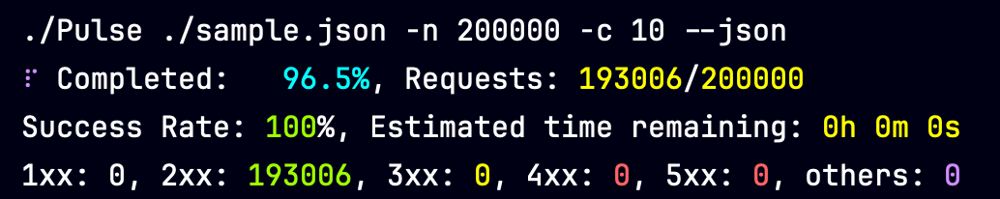
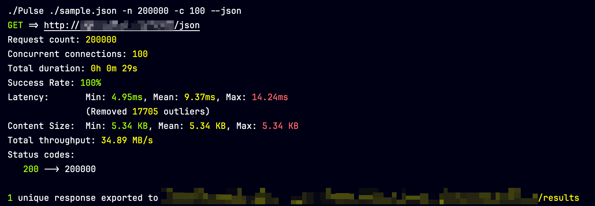

# Pulse 

Pulse is a general purpose, cross-platform, performance-oriented, command-line utility for testing HTTP endpoints. Pulse was inspired by [Bombardier](https://github.com/codesenberg/bombardier), but is designed to be configured, have native support for proxies, and suited for heavier and more frequent workflows.

## Features

- JSON based request configuration
- Proxy support
- Configurable concurrency via max connection limits and optional per-request delays
- Supports all HTTP methods
- Supports Headers
- Support Content-Type and Body for POST, PUT, PATCH, and DELETE
- Custom HTML generated outputs for easy inspection
- Structured output toggle (PlainText or JSON) for terminals, scripts, and LLMs
- Format JSON outputs
- Captures all response headers for debugging
- Quiet mode to silence progress noise when piping or scripting

And more!

## Installation

Pulse comes in a pre-build self-contained binary, which can be downloaded from the [releases](https://github.com/dusrdev/Pulse/releases) page.

## Usage

Pulse reads the JSON input and outputs the results respective to the working path, which means that Pulse can be added to path and used anywhere.

### Sending a single request using JSON configuration

```bash
Pulse configuration.json
```

### Sample outputs

During the execution, `Pulse` displays current metrics such as progress, success rate, ETA, and counts of responses from each of the 6 categories, i.e, 1xx, 2xx, 3xx, 4xx, 5xx, others. where `others` is essentially exceptions.



After the execution (different configuration in this example), `Pulse` produces a detailed summary of the results



### Setting up a configuration file

The configuration file is a JSON file that contains proxy information and the request details.

It is recommended to use the built-in `get-sample` command to generate a sample configuration file.

```bash
Pulse get-sample
```

This will generate a `sample.json` file in the current directory.

The `sample.json` file contains the following:

```json
{
 "Proxy": {
  "Bypass": true,
  "IgnoreSSL": false,
  "Host": "",
  "Username": "",
  "Password": ""
 },
  "Request": {
    "Url": "https://ipinfo.io/geo",
    "Method": {
      "Method": "GET"
    },
    "Headers": {},
    "Content": {
      "ContentType": "",
      "Body": null
    }
  }
}
```

#### Proxy

Proxy contains the configuration that would be used for the HTTP client.

By default the proxy parameters are set to empty, and the proxy is set to bypass (which means use defaults of the OS).

- `Bypass` - can be set to `true` even if the proxy parameters are not empty, to make AB testing easier.
- `Host` - can be used alone, or in combination with `Username` and `Password` to specify the proxy host.
- The credentials (i.e `Username` and `Password`) will only be used if both are specified.

#### Request

Request contains the configuration for the request.

- `Url` - the URL of the request.
- `Method` - the HTTP method of the request.
- `Headers` - the headers of the request. Can be `null` or a `JSON` object.

#### Content

Content contains the configuration for the request content. Which is only used for `POST`, `PUT`, `PATCH`, and `DELETE` requests.

- `ContentType` - the content type of the request content, if empty will default to `application/json`.
- `Body` - the body of the request content, `null` or any type of object including `JSON`. If set to `null` it will not be attached to the request.

## Options

Pulse has a wide range of options that can be configured in the command line, and can be viewed with `help` or `--help` which shows this:

```plaintext
Usage: [command] [arguments...] [options...] [-h|--help] [--version]

Pulse - A hyper fast general purpose HTTP request tester

Arguments:
  [0] <string>    Path to .json request details file [use "get-sample" if you don't have one]

Options:
  --json                      Try to format response content as JSON (Optional)
  --raw                       Export raw results [without wrapping in custom HTML] (Optional)
  --output-format <enum>      Output as PlainText|JSON (Default: PlainText)
  --quiet                     Suppress progress output on stderr (only fatal errors will be shown) (Default: False)
  -f, --full-equality         Use full equality [slower] (Optional)
  --no-export                 Don't export results (Optional)
  -v, --verbose               Display verbose output (Optional)
  --no-op                     Print selected configuration but don't run (Optional)
  -o, --output <string>       Output folder (Default: @"results")
  -d, --delay <int>           Delay in milliseconds between requests (Default: -1)
  -c, --connections <int?>    Maximum number of parallel requests (Default: null)
  -u, --url <string?>         Override the url of the request (Default: null)
  -n, --number <int>          Number of total requests (Default: 1)
  -t, --timeout <int>         Timeout in milliseconds (Default: -1)

Commands:
  check-for-updates    Checks whether there is a new version out on GitHub releases.
  cli-schema           Returns the usage schema for the app in JSON format.
  get-sample           Generate sample request file.
  get-schema           Generate a json schema for a request file.
  terms-of-use         Print the terms of use.
```

- `--json` - try to format response content as JSON.
- `--raw` - export raw results without custom HTML; can be combined with `--json`.
- `--output-format PlainText|JSON` (global) - choose human-readable console output or structured JSON for automation/LLMs.
- `--quiet` (global) - suppress progress updates on stderr; only fatal errors remain. Useful when piping to `jq` or when stderr/stdout are merged.
- `-f|--full-equality` - enforce full response equality checks instead of length-based comparisons.
- `-v|--verbose` - display per-request logging instead of the dashboard UI.
- `--no-op` - print the parsed configuration without running any requests.
- `-c|--connections` - cap parallel requests; set to `1` for sequential execution or leave unset to match the total request count.
- `-d|--delay` - add a delay (ms) after each request completes; useful when `--connections` is `1`.
- `-u|--url` - override the request URL while keeping the rest of the configuration unchanged.
- `-o|--output` - choose a custom output directory (defaults to `results`).
- `-n|--number` and `-t|--timeout` - control how many requests run and the per-request timeout (ms).

## Disclaimer

By using `Pulse` you agree to take full responsibility for the consequences of its use.

Usage of this tool for attacking targets without prior mutual consent is illegal. It is the end user's
responsibility to obey all applicable local, state and federal laws.
The developers assume no liability and are not responsible for any misuse or damage caused by this program.

## Contributing and Error reporting

- Errors, and features can be reported on the [issues](https://github.com/dusrdev/Pulse/issues) page.
- Sensitive bug reports can also be sent to `dusrdev@gmail.com`.
- Discussions can be found on the [discussions](https://github.com/dusrdev/Pulse/discussions) page.
- If anyone wants to contribute, feel free to fork the project and open a pull request.

> This project is proudly made in Israel 🇮🇱 for the benefit of mankind.
